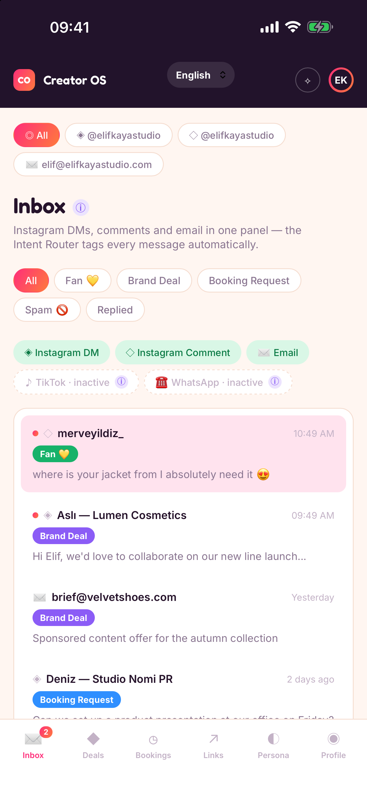
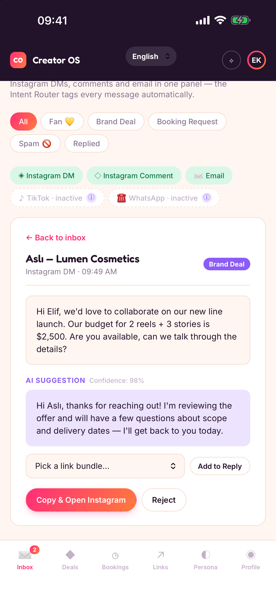
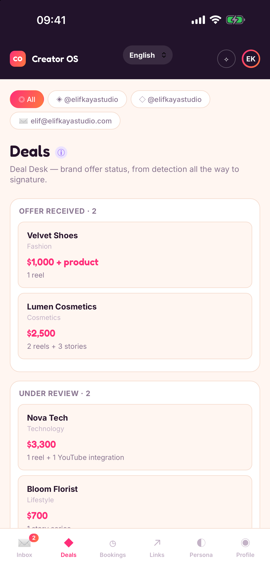
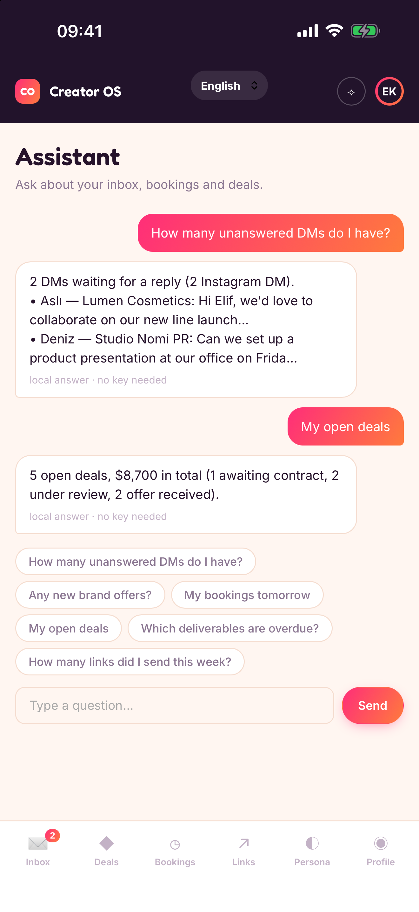

# Creator OS

**Turkish version: [README.tr.md](README.tr.md)**

A backend-free native mobile app (iOS + Android) that acts as a **receptionist for
social-media creators**: it sorts incoming messages by intent, drafts replies in the
creator's own voice, and tracks brand deals, bookings and link bundles — all on the
device. There is no server of ours: data lives in an on-device SQLite database, and the
optional AI features call OpenAI directly with the user's **own** API key.

<p align="center">
  
  
  
  
</p>

> **Status:** feature-complete for a first release, not yet published. The inbox runs on
> fictional sample data — the app is **not** connected to real Instagram, e-mail, TikTok or
> WhatsApp inboxes (see [What it is not](#what-it-is-not)). Release steps are in
> [`mobile/store/YAPILACAKLAR.md`](mobile/store/YAPILACAKLAR.md).

## Features

| Area | What it does |
|---|---|
| **Inbox** | Instagram DM / comment / e-mail threads in one list, filtered by intent and account |
| **Intent router** | On-device, rule-based classifier: fan, brand deal, collaboration, booking request, spam |
| **Reply drafts** | Per-persona templates; with Pro + your own OpenAI key, real AI drafts in the sender's language |
| **Sending** | Opens your mail app or copies the text and opens Instagram; the thread moves to "replied" only after you confirm you sent it |
| **Deals** | Kanban from offer to signature, deliverables with proof links, payments, performance; confirmation e-mail to the other party |
| **Bookings** | Bookings created from a booking-request DM; `.ics` export to any calendar app (Pro) |
| **Link bundles** | Reusable link packs added to a reply with one tap; send tracking (Pro to create) |
| **Assistant** (Pro) | Ask about your inbox, bookings, deals and links — answered locally, or by OpenAI with your key for open questions |
| **Notifications** (Pro) | Local notification rules for brand offers, booking requests and DM counts |
| **Siri / Android shortcuts** (Pro) | Voice and launcher shortcuts that read the same on-device database |
| **Multi-account** | Account tabs across inbox, deals and bookings |

**Free vs Pro** (enforced on the client): free allows 2 accounts and 5 deals; Pro is unlimited and
unlocks AI drafts, the assistant, notification rules, calendar export, link-bundle creation and the shortcuts.

**Languages:** Turkish, English, German, French, Italian, Spanish and Arabic (right-to-left).
Everything follows the chosen language — UI, assistant answers, classifier keywords, reply templates, Siri
answers, number/currency/date formats. Each deal keeps its own currency (no conversion).
Translations other than Turkish/English are hand-written and need a native review before release.

## Tech stack

- **Capacitor 8** shell, plain JavaScript (no UI framework), bundled with **esbuild** into one file
- **SQLite** on the device via `@capacitor-community/sqlite` (jeep-sqlite + sql.js as the browser fallback)
- **RevenueCat** for the Pro subscription; the Pro state is mirrored to native storage for Siri
- **Secure storage** (Keychain / Keystore) for the user's OpenAI key
- Native extras: iOS App Intents (`SiriIntents.swift`), Android static shortcuts, local notifications
- Fonts (Inter, Fredoka) are bundled — the app makes no third-party requests at start-up

## Getting started

Requirements: Node + [pnpm](https://pnpm.io), Xcode (iOS), Android Studio with **JDK 21** (Android).

```bash
cd mobile
pnpm install
pnpm run build          # bundles src/ into www/
npx cap sync            # copies www/ into ios/ and android/
```

Run it:

```bash
pnpm run serve          # web preview at http://localhost:4174 (needs a build first)
npx cap open ios        # Xcode
npx cap open android    # Android Studio
```

Two things to know:

- **Pro on the web preview:** the subscription SDK doesn't run in a browser. Set
  `localStorage.creatoros_dev_pro_override = "true"` and reload to try Pro screens.
- **RevenueCat keys are placeholders** (`REPLACE_WITH_REVENUECAT_*` in `mobile/src/entitlements.js`), so a
  build shows the free tier until real keys are added.

There is no automated test suite yet; changes have been verified by hand in the browser, the iOS Simulator
and an Android emulator.

## Project layout

```
mobile/
  src/                 app source (bundled to www/)
    app.js             UI, state, all screens
    db.js              SQLite schema, migrations, queries
    seed.js            first-launch sample data (Turkish or English)
    intent-classifier.js  keyword classifier (7 languages)
    ai-draft-generator.js templates + OpenAI drafts
    assistant.js       local answers + AI layer
    entitlements.js    RevenueCat, Pro flag, OpenAI key storage
    i18n*.js           language registry and translations
    notifications.js, calendar-export.js, data.js, styles.css, fonts.css, index.html
  ios/  android/       native projects (Capacitor)
  store/               privacy policy, store-form answers, store screenshots, release checklist
  _parked-youtube/     a removed YouTube-comments integration, kept for later
```

## Privacy in short

No accounts, no analytics, no ads, no tracking. Your data stays in the app sandbox. Data leaves the device
only for (1) OpenAI, when a Pro user has entered their own key and asks for an AI draft or answer, and
(2) RevenueCat, to manage the subscription. Full text: [`mobile/store/privacy-policy.en.md`](mobile/store/privacy-policy.en.md).

## What it is not

The app does not log in to Instagram, e-mail or any other account and does not receive your real messages.
Replying always hands the text to your mail app or Instagram, and you press send. Real-time notifications
for messages arriving while the app is closed would need a server, which this project deliberately does not have.

## License

No license has been chosen yet; all rights reserved by the author.
