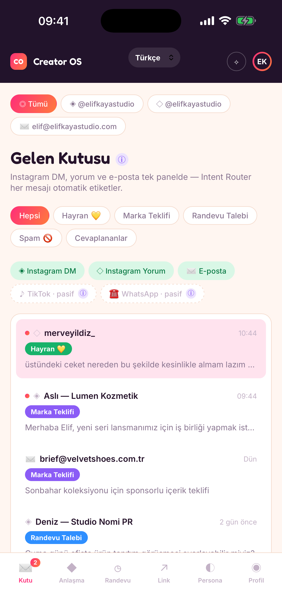
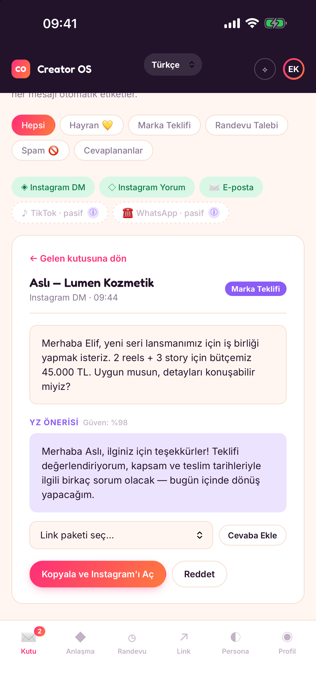
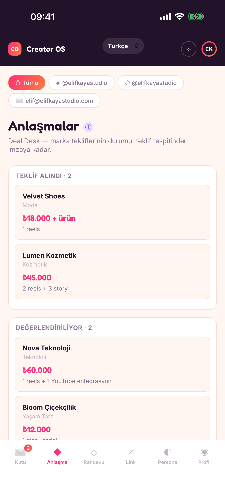
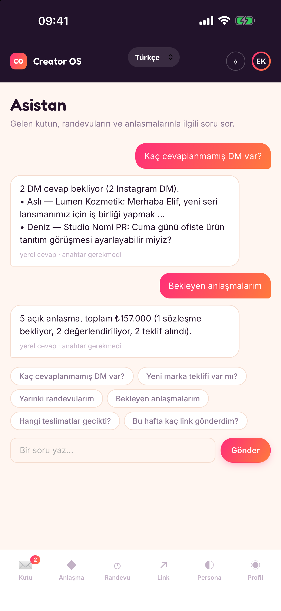

# Creator OS

**English version: [README.md](README.md)**

İçerik üreticileri için **sosyal medya resepsiyonisti** olan, sunucusuz bir yerel mobil uygulama
(iOS + Android). Gelen mesajları niyetine göre ayırır, yanıtları üreticinin kendi üslubunda taslak
olarak hazırlar; marka anlaşmalarını, randevuları ve link paketlerini takip eder — hepsi cihazın
içinde. Bize ait bir sunucu yok: veriler cihazdaki SQLite veritabanında durur, isteğe bağlı YZ özellikleri
OpenAI'ı kullanıcının **kendi** API anahtarıyla doğrudan çağırır.

<p align="center">
  
  
  
  
</p>

> **Durum:** ilk sürüm için özellikleri tamam, henüz yayınlanmadı. Gelen kutusu kurgusal örnek veriyle
> çalışır — uygulama gerçek Instagram, e-posta, TikTok veya WhatsApp kutularına **bağlı değildir**
> ([Ne değildir](#ne-değildir)). Yayın adımları [`mobile/store/YAPILACAKLAR.md`](mobile/store/YAPILACAKLAR.md) içinde.

## Özellikler

| Alan | Ne yapar |
|---|---|
| **Gelen kutusu** | Instagram DM / yorum / e-posta konuşmaları tek listede; niyete ve hesaba göre süzülür |
| **Niyet yönlendirici** | Cihazda çalışan kural tabanlı sınıflandırıcı: hayran, marka teklifi, iş birliği, randevu talebi, spam |
| **Yanıt taslakları** | Persona'ya göre şablonlar; Pro + kendi OpenAI anahtarınla, gönderenin dilinde gerçek YZ taslakları |
| **Gönderme** | Posta uygulamanı açar ya da metni kopyalayıp Instagram'ı açar; konuşma, gönderdiğini onaylayınca "yanıtlandı"ya geçer |
| **Anlaşmalar** | Tekliften imzaya kanban; kanıt bağlantılı teslimatlar, ödemeler, performans; karşı tarafa teyit e-postası |
| **Randevular** | Randevu talebi DM'inden randevu; her takvim uygulamasına `.ics` aktarımı (Pro) |
| **Link paketleri** | Tek dokunuşla yanıta eklenen link paketleri; gönderim takibi (oluşturmak Pro) |
| **Asistan** (Pro) | Gelen kutun, randevuların, anlaşmaların ve linklerin hakkında soru sor — yerelde ya da açık sorularda kendi anahtarınla OpenAI'la yanıtlanır |
| **Bildirimler** (Pro) | Marka teklifi, randevu talebi ve DM sayısı için yerel bildirim kuralları |
| **Siri / Android kısayolları** (Pro) | Aynı cihaz içi veritabanını okuyan sesli ve başlatıcı kısayolları |
| **Çoklu hesap** | Gelen kutusu, anlaşmalar ve randevularda hesap sekmeleri |

**Ücretsiz / Pro** (istemci tarafında uygulanır): ücretsizde 2 hesap ve 5 anlaşma; Pro sınırsızdır ve
YZ taslaklarını, asistanı, bildirim kurallarını, takvim aktarımını, link paketi oluşturmayı ve kısayolları açar.

**Diller:** Türkçe, İngilizce, Almanca, Fransızca, İtalyanca, İspanyolca ve Arapça (sağdan sola). Seçilen dil her
şeye uygulanır — arayüz, asistan cevapları, sınıflandırıcı anahtar kelimeleri, yanıt şablonları, Siri cevapları,
sayı/para birimi/tarih biçimleri. Her anlaşma kendi para birimini korur (çeviri yapılmaz). Türkçe ve İngilizce
dışındaki çeviriler elle yazıldı; yayından önce ana dili konuşan biri bakmalı.

## Teknoloji

- **Capacitor 8** kabuğu, düz JavaScript (arayüz çatısı yok), **esbuild** ile tek dosyada paketlenir
- Cihazda **SQLite**: `@capacitor-community/sqlite` (tarayıcı yedeği olarak jeep-sqlite + sql.js)
- Pro aboneliği için **RevenueCat**; Pro durumu Siri için yerel depoya yansıtılır
- OpenAI anahtarı için **güvenli depo** (Keychain / Keystore)
- Yerel ekstralar: iOS App Intents (`SiriIntents.swift`), Android statik kısayolları, yerel bildirimler
- Yazı tipleri (Inter, Fredoka) uygulamanın içinde — açılışta üçüncü taraf isteği yapılmaz

## Başlarken

Gerekenler: Node + [pnpm](https://pnpm.io), Xcode (iOS), **JDK 21** ile Android Studio (Android).

```bash
cd mobile
pnpm install
pnpm run build          # src/ klasörünü www/ içine paketler
npx cap sync            # www/ içeriğini ios/ ve android/ içine kopyalar
```

Çalıştırma:

```bash
pnpm run serve          # http://localhost:4174 adresinde web önizlemesi (önce derleme gerekir)
npx cap open ios        # Xcode
npx cap open android    # Android Studio
```

İki not:

- **Web önizlemesinde Pro:** abonelik SDK'sı tarayıcıda çalışmaz. Pro ekranlarını görmek için
  `localStorage.creatoros_dev_pro_override = "true"` yazıp sayfayı yenile.
- **RevenueCat anahtarları yer tutucudur** (`mobile/src/entitlements.js` içinde `REPLACE_WITH_REVENUECAT_*`);
  gerçek anahtarlar girilene kadar derleme ücretsiz sürümü gösterir.

Henüz otomatik test paketi yok; değişiklikler tarayıcıda, iOS Simülatör'de ve bir Android emülatöründe elle doğrulandı.

## Klasör yapısı

```
mobile/
  src/                 uygulama kaynağı (www/ içine paketlenir)
    app.js             arayüz, durum, tüm ekranlar
    db.js              SQLite şeması, geçişler, sorgular
    seed.js            ilk açılış örnek verisi (Türkçe veya İngilizce)
    intent-classifier.js  anahtar kelime sınıflandırıcı (7 dil)
    ai-draft-generator.js şablonlar + OpenAI taslakları
    assistant.js       yerel cevaplar + YZ katmanı
    entitlements.js    RevenueCat, Pro bayrağı, OpenAI anahtarı saklama
    i18n*.js           dil kaydı ve çeviriler
    notifications.js, calendar-export.js, data.js, styles.css, fonts.css, index.html
  ios/  android/       yerel projeler (Capacitor)
  store/               gizlilik politikası, mağaza formu cevapları, ekran görüntüleri, yayın listesi
  _parked-youtube/     kaldırılmış bir YouTube yorum entegrasyonu, ileride için saklı
```

## Kısaca gizlilik

Hesap, analitik, reklam ve izleme yok. Verilerin uygulamanın kum havuzunda kalır. Cihazdan dışarı yalnızca
(1) Pro kullanıcı kendi anahtarını girip YZ taslağı ya da cevabı istediğinde OpenAI'a ve (2) abonelik yönetimi için
RevenueCat'e veri gider. Tam metin: [`mobile/store/privacy-policy.tr.md`](mobile/store/privacy-policy.tr.md).

## Ne değildir

Uygulama Instagram'a, e-postaya ya da başka bir hesaba giriş yapmaz ve gerçek mesajlarını almaz. Yanıtlamak her
zaman metni posta uygulamana ya da Instagram'a verir; gönder tuşuna sen basarsın. Uygulama kapalıyken gelen mesajlar
için anlık bildirim bir sunucu gerektirir; bu proje bilinçli olarak sunucusuzdur.

## Lisans

Henüz lisans seçilmedi; tüm haklar yazara aittir.
